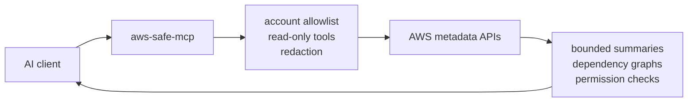

# aws-safe-mcp

[](https://github.com/harryhazza77/aws-safe-mcp/actions/workflows/ci.yml)
[](https://pypi.org/project/aws-safe-mcp/)
[](https://pypi.org/project/aws-safe-mcp/)

Safe, read-only AWS investigation tools for AI coding agents.

`aws-safe-mcp` is a local, read-only MCP server for investigating AWS resources
without exposing a raw AWS SDK escape hatch. It gives AI clients structured,
bounded tools for debugging serverless workloads while preserving IAM as the
authorization boundary.

**Status:** alpha. The server is intentionally read-only in v1, and tool outputs
are designed for investigation rather than complete AWS inventory export.

Use it to:

- Trace serverless dependencies across Lambda, EventBridge, Step Functions, and
  API Gateway.
- Inspect recent failure signals without exposing secrets or raw payloads.
- Check permission paths with IAM simulation when available.
- Give AI clients useful AWS context without handing them a raw SDK shell.



## Why This Exists

AI clients are useful for debugging AWS systems, but a raw AWS SDK or CLI
passthrough gives them too much power and too little context. `aws-safe-mcp`
keeps the useful part: curated tools that answer common investigation questions
about Lambda, Step Functions, API Gateway, EventBridge, S3, DynamoDB, and
CloudWatch.

Good questions for this server:

- Which AWS resources are connected to this workload?
- What failed recently, and which signal should I inspect next?
- Does an execution role or resource policy appear to allow the expected path?
- Am I looking at the intended AWS account before resource calls run?

## Safety Promises

- No generic `aws_call` tool.
- No write-capable AWS tools in v1.
- No raw AWS SDK passthrough.
- No S3 object body reads.
- No DynamoDB scan, query, or item reads.
- No secret, parameter, or Lambda environment value disclosure.
- AWS account IDs must be explicitly allowlisted.
- Tool calls are audit logged as structured JSON to stderr.
- Secret-like values are redacted and long strings are truncated.

See [docs/limitations.md](docs/limitations.md) for known limitations and safety
tradeoffs.

## Demo

Prompt:

```text
Trace the event-driven flow for source aws.s3, detail type Object Created,
bucket <bucket-name>, and .csv object keys. Use AWS MCP only.
```

Example result shape:

```text
S3 Object Created event
  -> EventBridge rule matched on bucket and .csv suffix
  -> Step Functions state machine target
  -> Lambda task dependency
  -> DynamoDB write permission check: allowed

Warnings:
  - IAM simulation unavailable for one optional edge
  - No raw event payloads, S3 object bodies, or secret values returned
```

The useful part is not just listing resources. The tool connects AWS metadata
into a small explanation an AI client can reason over.

## Quickstart

Install from a local checkout:

```bash
uv sync
uv run aws-safe-mcp --help
```

Create a local config file, for example
`~/.config/aws-safe-mcp/config.yaml`:

```yaml
allowed_account_ids:
  - "123456789012"

readonly: true
```

Run the server with a non-production AWS profile:

```bash
uv run aws-safe-mcp \
  --profile dev \
  --region eu-west-2 \
  --readonly \
  --config ~/.config/aws-safe-mcp/config.yaml
```

After package publication, the intended runtime shape is:

```bash
uvx aws-safe-mcp \
  --profile dev \
  --region eu-west-2 \
  --readonly \
  --config ~/.config/aws-safe-mcp/config.yaml
```

In an MCP client, start with:

```text
Check my AWS auth status. Use AWS MCP only.
```

Then try an investigation prompt:

```text
Search AWS resources for <name-fragment>. Use AWS MCP only.
```

```text
Explain the dependencies for Lambda <function-name>. Use AWS MCP only.
```

```text
Trace the event-driven flow for source aws.s3, detail type Object Created, bucket <bucket-name>, and .csv object keys. Use AWS MCP only.
```

## Tools

The server includes identity, inventory, dependency, permission-checking, and
failure-investigation tools for:

- Lambda
- Step Functions
- S3 metadata
- DynamoDB metadata
- CloudWatch Logs
- API Gateway
- EventBridge
- Cross-service resource search

See [docs/tools.md](docs/tools.md) for the full tool catalog, inputs, and shared
dependency graph contract.

## Client Setup

Provider-neutral setup notes:

- [AI client notes](docs/ai-clients.md)
- [Claude Code](docs/claude-code.md)
- [Claude Desktop](docs/claude-desktop.md)
- [Cursor](docs/cursor.md)

Claude Desktop example:

```json
{
  "mcpServers": {
    "aws": {
      "command": "uvx",
      "args": [
        "aws-safe-mcp",
        "--profile",
        "dev",
        "--region",
        "eu-west-2",
        "--readonly",
        "--config",
        "~/.config/aws-safe-mcp/config.yaml"
      ]
    }
  }
}
```

## AWS Authentication

Use an existing AWS config profile. The MCP server can start before login, so
this is fine:

```bash
uvx aws-safe-mcp --profile dev --region eu-west-2 --readonly --config ~/.config/aws-safe-mcp/config.yaml
```

If `aws_auth_status` reports `authenticated: false`, authenticate normally:

```bash
aws login --profile dev
# or:
aws sso login --profile dev
```

The next `aws_auth_status` or AWS tool call re-checks STS. You do not need to
restart the MCP server.

## Permissions

Grant only the read actions needed for the tools you plan to use. Common actions
include:

- Identity: `sts:GetCallerIdentity`
- Lambda: `lambda:ListFunctions`, `lambda:GetFunctionConfiguration`,
  `lambda:ListAliases`, `lambda:ListEventSourceMappings`, `lambda:GetPolicy`
- IAM checking: `iam:GetRole`, `iam:ListAttachedRolePolicies`,
  `iam:ListRolePolicies`, `iam:SimulatePrincipalPolicy`
- Logs and metrics: `cloudwatch:GetMetricData`, `logs:DescribeLogGroups`,
  `logs:FilterLogEvents`
- EventBridge: `events:ListEventBuses`, `events:ListRules`,
  `events:DescribeRule`, `events:ListTargetsByRule`
- Step Functions: `states:ListStateMachines`, `states:DescribeStateMachine`,
  `states:DescribeExecution`, `states:GetExecutionHistory`
- Metadata only: `s3:ListAllMyBuckets`, `s3:ListBucket`,
  `s3:GetBucketLocation`, `dynamodb:ListTables`, `dynamodb:DescribeTable`,
  `apigateway:GET`

Some dependency tools can return richer results when optional read permissions
for SQS, SNS, S3 bucket settings, or IAM simulation are available. Missing
optional permissions should produce warnings rather than failing the whole
investigation.

## Development

Run the local verification suite:

```bash
uv run ruff format --check .
uv run ruff check .
uv run mypy
uv run bandit -q -r src
uv run pip-audit
uv run pytest --cov=aws_safe_mcp --cov-report=term-missing
uv run aws-safe-mcp --help
uv build
uvx --from . aws-safe-mcp --help
```

More development and release details:

- [Development guide](docs/development.md)
- [Architecture](docs/architecture.md)
- [Release checklist](docs/release.md)
- [Documentation index](docs/README.md)

## Release Safety

Before publishing or tagging a release:

- Run the full verification suite.
- Inspect source and wheel package contents.
- Run a live MCP smoke test in a non-production AWS account when available.
- Confirm examples use fake account IDs and generic profile names.
- Confirm no local profile names, account IDs, ARNs, credentials, logs, or
  resource names are committed.

See [docs/release.md](docs/release.md) for the complete release runbook.

## Discoverability Checklist

When publishing on GitHub, set the repository description to:

```text
Safe, read-only MCP server for AWS investigation by AI coding agents
```

Suggested topics:

```text
mcp, aws, ai-agents, model-context-protocol, lambda, serverless, cloudwatch,
eventbridge, step-functions, developer-tools, security
```
